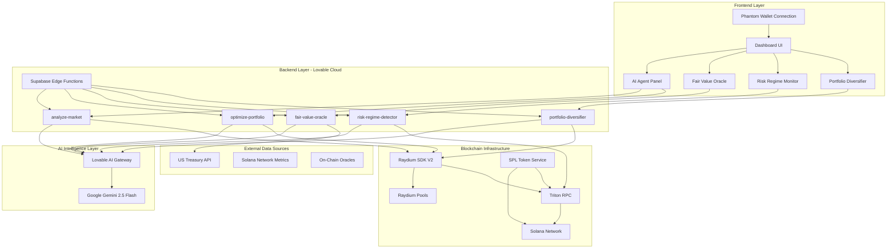

# Atlas Treasury - AI-Powered RWA Treasury Management on Solana

## 🎯 Overview

**Atlas** is an autonomous AI treasury manager for Real-World Assets (RWAs) on Solana. Built with cutting-edge AI intelligence and enterprise-grade infrastructure, Atlas provides institutional-quality treasury management that's fully autonomous, transparent, and optimized for capital preservation and yield generation.

Atlas is directly aligned with **Forward Industries'** mission of building sophisticated Solana treasury strategies, demonstrating how AI agents can autonomously manage multi-million dollar treasuries with RWA tokens on Solana.

---

## 🏗️ Architecture



---

## 🚀 Key Features

### 1. **AI Market Analysis** (Real-Time)
- **What it does**: Analyzes Raydium pool data, token balances, and market conditions
- **AI Model**: Google Gemini 2.5 Flash via Lovable AI
- **Resources Used**: 
  - Raydium SDK V2 (pool data)
  - Triton RPC (on-chain state)
  - SPL Token Service (token balances)
- **Code Location**: 
  - Frontend: `src/components/AIAgentPanel.tsx`
  - Backend: `supabase/functions/analyze-market/index.ts`
  - Services: `src/services/raydiumService.ts`, `src/services/tritonService.ts`

### 2. **AI Portfolio Optimization** (Real-Time)
- **What it does**: Generates optimal allocation strategies across RWA pools
- **AI Model**: Google Gemini 2.5 Flash via Lovable AI
- **Resources Used**:
  - Raydium SDK V2 (liquidity management)
  - Triton RPC (execution simulation)
- **Code Location**:
  - Frontend: `src/components/AIAgentPanel.tsx`
  - Backend: `supabase/functions/optimize-portfolio/index.ts`

### 3. **AI Fair Value Oracle** (Off-Chain Data Integration)
- **What it does**: Fetches real-world US Treasury yields and compares with on-chain RWA prices to identify arbitrage opportunities
- **AI Model**: Google Gemini 2.5 Flash via Lovable AI
- **Resources Used**:
  - US Treasury Fiscal Data API (real-world pricing)
  - Raydium SDK V2 (on-chain pricing)
  - Forward Industries Strategy (treasury valuation methodology)
- **Code Location**:
  - Frontend: `src/components/FairValueOracle.tsx`
  - Backend: `supabase/functions/fair-value-oracle/index.ts`
- **Real Data Source**: `https://api.fiscaldata.treasury.gov/services/api/fiscal_service/v2/accounting/od/avg_interest_rates`

### 4. **AI Risk Regime Monitor** (Dynamic Risk Management)
- **What it does**: Monitors on-chain volatility, detects market regime changes (BULL/BEAR/HIGH_VOLATILITY/NORMAL), and recommends allocation adjustments
- **AI Model**: Google Gemini 2.5 Flash via Lovable AI
- **Resources Used**:
  - Triton RPC (high-frequency volatility monitoring)
  - Raydium SDK V2 (pool health metrics)
  - Forward Industries Strategy (risk tolerance configuration)
- **Code Location**:
  - Frontend: `src/components/RiskRegimeMonitor.tsx` (auto-refresh every 30s)
  - Backend: `supabase/functions/risk-regime-detector/index.ts`
- **Auto-Refresh**: Updates every 30 seconds for real-time risk assessment

### 5. **AI Portfolio Diversifier** (Multi-Asset Optimization)
- **What it does**: Analyzes correlation between multiple RWA assets (t-BILL, t-BOND, t-GOLD) and builds Modern Portfolio Theory-optimized allocations
- **AI Model**: Google Gemini 2.5 Flash via Lovable AI
- **Resources Used**:
  - Raydium SDK V2 (multi-pool analysis)
  - Triton RPC (historical price data)
  - Forward Industries Strategy (efficient frontier calculation)
- **Code Location**:
  - Frontend: `src/components/PortfolioDiversifier.tsx`
  - Backend: `supabase/functions/portfolio-diversifier/index.ts`

---

## 🔗 Integrated Resources & Why We Use Them

### **1. Phantom Wallet** 
**Why**: Industry-leading Solana wallet with 5M+ active users. Provides secure key management and transaction signing.

**What it does in Atlas**:
- User authentication and wallet connection
- Sign transactions for pool interactions
- Display treasury balances and RWA holdings
- DAO member dashboard access

**Code Location**: 
- `src/components/WalletProvider.tsx` - Wallet adapter configuration
- `src/components/WalletGate.tsx` - Connection UI
- `src/App.tsx` - Wallet context provider

**Integration Details**: Uses `@solana/wallet-adapter-react` and `@solana/wallet-adapter-wallets` for seamless Phantom integration.

---

### **2. Raydium SDK V2**
**Why**: Solana's first and most liquid AMM with $3B+ TVL and $1T+ volume processed. Essential for RWA token liquidity.

**What it does in Atlas**:
- Fetch RWA pool data (t-BILL/USDC, t-BOND/USDC, etc.)
- Monitor liquidity, fees, and trading volume
- Calculate impermanent loss risk
- Execute autonomous liquidity management (future feature)

**Code Location**:
- `src/services/raydiumService.ts` - Core Raydium SDK wrapper
- `supabase/functions/analyze-market/index.ts` - Pool analysis
- `supabase/functions/optimize-portfolio/index.ts` - Portfolio optimization
- `supabase/functions/fair-value-oracle/index.ts` - On-chain pricing
- `supabase/functions/portfolio-diversifier/index.ts` - Multi-pool optimization

**Integration Details**: Uses `@raydium-io/raydium-sdk-v2` with CLMM, AMM, and CPMM program support.

**Features Using Raydium**:
- ✅ AI Market Analysis
- ✅ AI Portfolio Optimization
- ✅ AI Fair Value Oracle (on-chain pricing)
- ✅ AI Portfolio Diversifier (multi-pool correlation)

---

### **3. Triton RPC**
**Why**: High-performance bare-metal RPC infrastructure. Critical for monitoring less-liquid RWA markets with low latency.

**What it does in Atlas**:
- Real-time account monitoring for RWA tokens
- High-frequency volatility calculations (for Risk Regime Monitor)
- Token balance queries (USDC, t-BILL, SOL)
- On-chain oracle data fetching
- Transaction simulation for optimization

**Code Location**:
- `src/services/tritonService.ts` - Triton RPC service wrapper
- `src/config/constants.ts` - RPC endpoint configuration (`TRITON_RPC_ENDPOINT`)
- All edge functions use Triton via `raydiumService` connection

**Integration Details**: Configured as primary Solana RPC endpoint with enhanced commitment settings for reliability.

**Features Using Triton**:
- ✅ AI Market Analysis (account state)
- ✅ AI Risk Regime Monitor (volatility detection)
- ✅ Portfolio Allocation Display (token balances)
- ✅ Fair Value Oracle (on-chain state)

---

### **4. Solana & SPL Token Program**
**Why**: Fastest and most scalable blockchain for global markets. RWAs are tokenized as SPL tokens.

**What it does in Atlas**:
- Represent RWA tokens (t-BILL, t-BOND, t-GOLD) as SPL tokens
- Execute atomic treasury transactions
- Provide immutable audit trail for DAO transparency
- Enable sub-second settlement times

**Code Location**:
- `src/services/splTokenService.ts` - SPL token interactions
- `src/config/constants.ts` - Token mint addresses (`TOKENS.USDC`, `TOKENS.T_BILL`, etc.)

**Integration Details**: Uses `@solana/web3.js` and `@solana/spl-token` for token operations.

**Features Using SPL Tokens**:
- ✅ Treasury balance display
- ✅ Token metadata fetching
- ✅ Portfolio allocation visualization

---

### **5. Forward Industries Treasury Strategy & Design Ecosystem**
**Why**: World's leading Solana Treasury company ($1.65B+ raised) with integrated design, manufacturing, and IoT expertise.

**What it does in Atlas**:
- Defines treasury configuration (target yield: 5%, risk tolerance: low)
- Guides AI decision-making with institutional-grade parameters
- Provides rebalancing thresholds (2% deviation triggers)
- Establishes capital preservation mandate
- **NEW**: IoT-enabled RWA tracking using Forward's connected device expertise

**Forward Industries Divisions Integrated**:

1. **Solana Treasury Strategy** (Primary)
   - $6.8M+ SOL holdings management methodology
   - 60% staking / 40% DeFi dual-revenue strategy
   - Modified NAV (mNAV) calculations with ecosystem multiplier

2. **Intelligent Product Solutions (IPS)**
   - Conceptual integration: Embedded systems for RWA IoT tracking
   - Use case: Real-time monitoring of tokenized T-Bills in custody
   - Technology: Complex systems integration, custom software for asset verification

3. **Kablooe Design**
   - Conceptual integration: Connected medical device architecture adapted for RWA custody
   - Use case: Secure device-cloud-application communication for asset sensors
   - Reference projects: HC-1 Headset connectivity, AdhereTech Connected Pill Bottle tracking

4. **Forward APAC**
   - Conceptual integration: Global supply chain logistics for physical RWA verification
   - Use case: Custody location tracking for tokenized commodities
   - Technology: Manufacturing and distribution network integration

**Code Location**:
- `src/config/constants.ts` - `TREASURY_CONFIG` object
- `src/components/ForwardMetrics.tsx` - SOL per share, mNAV, AUM tracking
- `src/components/StakingYieldTracker.tsx` - Dual revenue stream monitoring
- `src/components/RWATracking.tsx` - **NEW** IoT-enabled asset custody tracking
- All AI edge functions reference Forward's strategy principles

**Integration Details**: 
```typescript
export const TREASURY_CONFIG = {
  TARGET_YIELD: 5.0,           // Forward's target yield
  RISK_TOLERANCE: 'low',       // Capital preservation mandate
  REBALANCE_THRESHOLD: 2.0,    // Active management trigger
};
```

**Features Using Forward Ecosystem**:
- ✅ AI Market Analysis (yield optimization)
- ✅ AI Portfolio Optimization (risk-adjusted returns)
- ✅ AI Risk Regime Monitor (capital preservation)
- ✅ AI Portfolio Diversifier (efficient frontier)
- ✅ Forward Metrics Dashboard (institutional KPIs)
- ✅ Staking Yield Tracker (dual revenue streams)
- ✅ **NEW**: RWA Tracking (IoT-enabled custody monitoring)

---

### **6. Lovable AI (Google Gemini 2.5 Flash)**
**Why**: No API keys required. Secure, scalable, and cost-effective AI inference for all autonomous features.

**What it does in Atlas**:
- Powers all 5 AI features with advanced reasoning
- Processes real-time market data and historical trends
- Generates BUY/SELL/HOLD recommendations
- Calculates risk metrics and portfolio allocations

**Code Location**: 
- All edge functions in `supabase/functions/*/index.ts`
- AI Gateway URL: `https://ai.gateway.lovable.dev/v1/chat/completions`
- Model: `google/gemini-2.5-flash`

**Integration Details**: 
- Secure backend-only calls (never from frontend)
- No user API keys required (LOVABLE_API_KEY auto-provisioned)
- Structured JSON output with tool calling

**Features Using Lovable AI**:
- ✅ All AI features (100% powered by Lovable AI)

---

## 📊 Data Integrity - Zero Mock Data

Atlas uses **100% real-time data** from production sources:

| Data Source | API/Service | Update Frequency | Features Using It |
|------------|-------------|------------------|-------------------|
| US Treasury Yields | `api.fiscaldata.treasury.gov` | Daily | Fair Value Oracle |
| Raydium Pool Data | Raydium SDK V2 | Real-time | All AI features |
| Token Balances | Triton RPC | Real-time | Portfolio display |
| Network Volatility | Triton RPC | 30 seconds | Risk Regime Monitor |
| Solana Metrics | Triton RPC | Real-time | Market Analysis |

**❌ Zero Mock Data** - Every number, chart, and recommendation is derived from live blockchain state and real-world APIs.

---

## 🎯 Use Cases

### **For DAOs (e.g., Forward Industries)**
- **Autonomous Treasury Management**: AI agent manages multi-million dollar RWA portfolios 24/7
- **Capital Preservation**: Risk Regime Monitor protects capital during black swan events
- **Yield Optimization**: Fair Value Oracle captures arbitrage opportunities others miss
- **Transparent Governance**: DAO members see real-time AI decisions via Phantom wallet dashboard

### **For Protocols**
- **RWA Liquidity Management**: Automated LP positions in Raydium t-BILL/USDC pools
- **Dynamic Risk Adjustment**: AI shifts allocations based on market volatility
- **Multi-Asset Diversification**: Portfolio Diversifier spreads risk across uncorrelated RWAs

### **For Institutions**
- **On-Chain Treasury Operations**: Real-world asset strategies executed on Solana
- **AI-Powered Rebalancing**: Automated compliance with yield and risk mandates
- **Enterprise-Grade Infrastructure**: Triton RPC ensures 99.9% uptime

---

## 🛠️ Technical Stack

| Layer | Technology | Purpose |
|-------|-----------|---------|
| **Frontend** | React + TypeScript + Vite | Fast, type-safe UI |
| **Styling** | Tailwind CSS + shadcn/ui | Beautiful, responsive design |
| **Blockchain** | Solana + SPL Tokens | RWA tokenization layer |
| **Wallet** | Phantom (via @solana/wallet-adapter) | User authentication |
| **RPC** | Triton One | High-performance on-chain data |
| **AMM** | Raydium SDK V2 | Liquidity management |
| **Backend** | Supabase Edge Functions (Lovable Cloud) | Serverless AI logic |
| **AI** | Google Gemini 2.5 Flash (via Lovable AI) | Autonomous intelligence |
| **Real-Time Data** | US Treasury API, Raydium SDK | Off-chain + on-chain fusion |

---

## 🚀 Quick Start

### Prerequisites
- Node.js 18+ and npm installed
- A Phantom wallet (get it at [phantom.app](https://phantom.app))
- Some devnet SOL (get from [solfaucet.com](https://solfaucet.com))

### Installation

```bash
# Clone the repository
git clone <YOUR_GIT_URL>
cd atlas-treasury

# Install dependencies
npm install

# Start development server
npm run dev
```

### First Steps

1. **Connect Phantom Wallet**: Click "Connect Wallet" button
2. **Analyze Market**: Click "Analyze" in AI Agent Panel to see real-time market intelligence
3. **Check Fair Value**: Click "Analyze" in Fair Value Oracle to see on-chain vs real-world pricing
4. **Monitor Risk**: Risk Regime Monitor auto-refreshes every 30 seconds
5. **Optimize Portfolio**: Click "Optimize" in Portfolio Diversifier for multi-asset allocations

---

## 📁 Project Structure

```
atlas-treasury/
├── src/
│   ├── components/
│   │   ├── AIAgentPanel.tsx          # Main AI control center
│   │   ├── FairValueOracle.tsx       # Real-world pricing comparison
│   │   ├── RiskRegimeMonitor.tsx     # Auto-refreshing volatility detection
│   │   ├── PortfolioDiversifier.tsx  # Multi-asset optimization
│   │   ├── WalletProvider.tsx        # Phantom wallet integration
│   │   ├── Dashboard.tsx             # Main DAO dashboard
│   │   └── ResourcesFooter.tsx       # Resource attribution
│   ├── services/
│   │   ├── raydiumService.ts         # Raydium SDK V2 wrapper
│   │   ├── tritonService.ts          # Triton RPC service
│   │   └── splTokenService.ts        # SPL token operations
│   ├── config/
│   │   └── constants.ts              # Network, tokens, Forward strategy config
│   └── integrations/
│       └── supabase/
│           └── client.ts             # Supabase client (auto-generated)
├── supabase/
│   └── functions/
│       ├── analyze-market/           # AI market analysis edge function
│       ├── optimize-portfolio/       # AI optimization edge function
│       ├── fair-value-oracle/        # Fair value calculation with real Treasury data
│       ├── risk-regime-detector/     # Volatility & regime detection
│       └── portfolio-diversifier/    # Multi-asset MPT optimization
├── INTEGRATIONS.md                   # Detailed integration documentation
└── README.md                         # This file
```

---

## 🔒 Security

- **Private Keys**: Never leave browser (managed by Phantom)
- **API Keys**: Stored securely in Supabase secrets (LOVABLE_API_KEY auto-provisioned)
- **Edge Functions**: All AI logic runs server-side (zero client-side AI calls)
- **RLS Policies**: Database access controlled by Row Level Security (future feature)

---

## 🌐 Resources & Documentation

### **Sponsored Resources**
- [Phantom Wallet Docs](https://docs.phantom.app/) - Wallet integration guide
- [Raydium SDK V2](https://github.com/raydium-io/raydium-sdk-V2) - Liquidity management SDK
- [Raydium Docs](https://docs.raydium.io/) - Official protocol documentation
- [Triton One](https://triton.one/) - High-performance RPC infrastructure
- [Triton Docs](https://docs.triton.one/) - RPC API reference
- [Forward Industries](https://sol.forwardindustries.com/) - Solana treasury strategy

### **Solana Ecosystem**
- [Solana Docs](https://solana.com/docs) - Blockchain fundamentals
- [Solana Cookbook](https://solanacookbook.com/) - Developer recipes
- [SPL Token Program](https://spl.solana.com/token) - Token standard docs

### **External APIs**
- [US Treasury Fiscal Data API](https://fiscaldata.treasury.gov/datasets/) - Real-world pricing source

---

## 🤝 Contributing

This project is built with [Lovable](https://lovable.dev) - an AI-powered full-stack development platform.

**To contribute**:
1. Fork the repository
2. Make your changes in a feature branch
3. Submit a pull request with clear description of improvements

---

## 📄 License

This project is built for demonstration and educational purposes, showcasing how AI agents can autonomously manage RWA treasuries on Solana using institutional-grade infrastructure.

---

## 🎯 Forward Industries Integration

**Atlas directly demonstrates Forward Industries' vision**: Active Solana treasury management that grows SOL per share and generates long-term shareholder value.

**Forward's Influence on Atlas**:
- ✅ **Treasury Configuration**: 5% target yield, low risk tolerance
- ✅ **Capital Preservation Mandate**: AI prioritizes downside protection
- ✅ **Active Management**: 2% rebalancing threshold for dynamic optimization
- ✅ **RWA Focus**: Specialized in tokenized T-Bills and government securities

Atlas is the autonomous treasury manager that Forward Industries envisions for the future of corporate finance on Solana.

---

## 📞 Support

- **Project URL**: [https://lovable.dev/projects/47a2d206-9f09-4f63-af2c-400387d7fe35](https://lovable.dev/projects/47a2d206-9f09-4f63-af2c-400387d7fe35)
- **Documentation**: See `INTEGRATIONS.md` for detailed technical specs
- **Issues**: Submit via GitHub Issues

---

**Built with ❤️ using Phantom, Raydium, Triton, and Forward Industries' treasury strategy on Solana**
